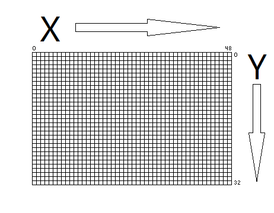

# Lesson 2
## Drawing Sprites And Capturing User Input

Now that we have learned how to draw an Image to the Full Screen, we can start to draw smaller Sprites as well! To do so, we will call on LibPerspective once again. The Syntax to Draw A Sprite is as follows:

	P_Draw_Sprite sprite_address, sprite_x_coordinate, sprite_y_coordinate

The X-Coordinate and Y-Coordinate determine where onscreen our Sprite will be drawn. The Sprite Address is an assigned section of Memory that contains the Data for Image itself. We will head back to the "Start" Section of our Code, before the Main Loop, and assign the Memory Addresses for all three of these:

 	;=======================;
	;   Include Libraries   ;
 	;=======================;
	...
 	
	;=======================;
	;   Define Variables:   ;
	;=======================;
	test_sprite_x			=	$6		; 1 Byte
  	test_sprite_y			=	$7		; 1 Byte
  	test_sprite_sprite_address	=	$8		; 2 Bytes
   
	;=======================;
	;  Prepare Application  ;
	;=======================;
 	.org	$00
 	...

Now that we have allocated where in Memory these will be, let's assign the actual Numbers and Image to them:

	start:
 	...
  	set1	ie,7

  	; Set Sprite Addresses
  	mov	#20, test_sprite_x
	mov	#12, test_sprite_y
	mov	#<Example_Sprite, test_sprite_sprite_address
	mov	#>Example_Sprite, test_sprite_sprite_address+1

 	Main_Loop:
  	...

As we can see, these are assigned after our Start Macro, but before the Main Loop. We can reassign them later, during the Main Loop, but in this instance we want to make sure they're populated before we begin; Errors can arise if we try to call on them when they're empty. Note that we have four variables here; the "<" and ">" for the Sprite Address are the two halves of the Image. Since the Origin, at 0,0, is at the Top-Left, then the Point we choose for drawing will be where the Top-Left of our Sprite is. The X- and Y-Coordinates count to the right and downward as the numbers increase:

     
So, we're ready to Draw our Sprite!

	  .Draw_Screen
     		P_Draw_Background_Constant Hello_World_BackGround
	   	P_Draw_Sprite	test_sprite_sprite_address, test_sprite_x, test_sprite_y
		P_Blit_Screen

Depending on which X/Y Coordinates you used, the Sprite may look a little funky, or cut off. We'll discuss why that is in a bit. Next, we'll learn how to Capture User Input and Move our Sprite!
